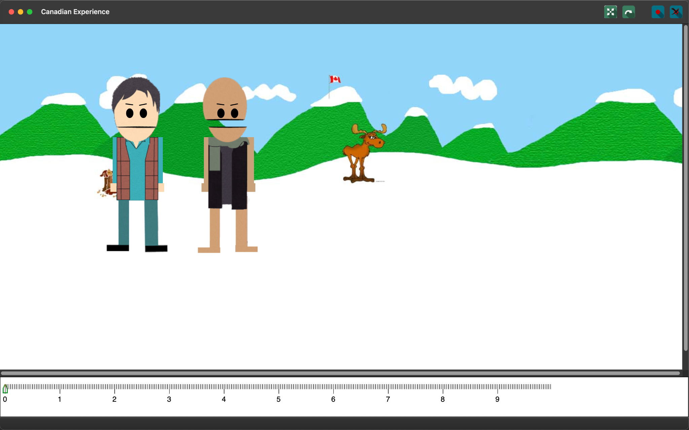

# Canadian Experience

An animated character editor and scene timeline system written in C++ using wxWidgets. Includes keyframing, custom actors, and a full scene editor. Allows users to create short animated sequences using a GUI-based timeline and visual character editor.



## 🎬 Features

- ✨ **Animated Characters**: Move, rotate, and pose characters using a visual editor.
- 🗓 **Timeline System**: Keyframe-based timeline for animating actors and props.
- 🔁 **Playback Support**: Preview animations in real-time with scrubbing and play buttons.
- 🛠 **Modular Actor System**: Characters are composed of drawable components like arms, heads, and props (scene graph style).
- 🧠 **Custom Logic**: Includes dynamic props such as a jack-in-the-box.
- 🎨 **Scene Editor**: Compose scenes with backgrounds, props, and multiple characters.

## 🧱 Tech Stack

- C++
- wxWidgets 3.2+
- CMake
- macOS/Linux/Windows compatible

## 🚀 Build Instructions (macOS/Linux)

### Prerequisites

- `wxWidgets` installed (use `brew install wxwidgets` on macOS)
- `cmake` and `make`

### Build and Run

```bash
mkdir build && cd build
cmake ..
make
./CanadianExperience.app/Contents/MacOS/CanadianExperience

